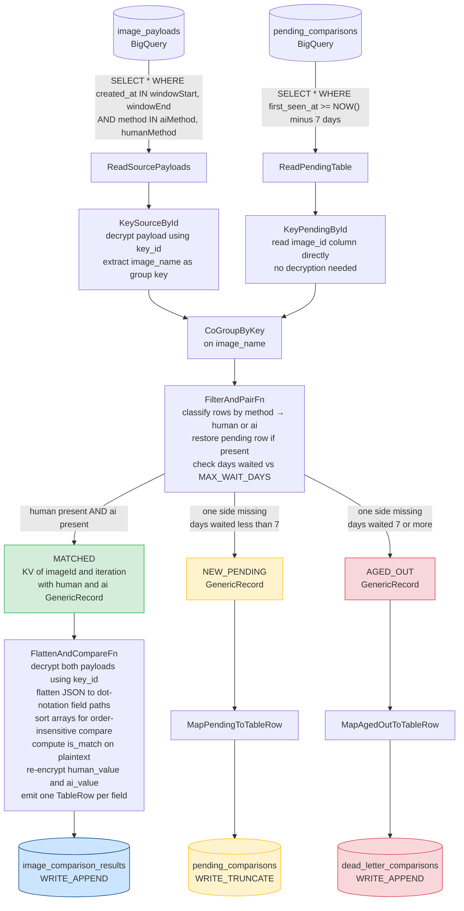

# Image Comparison Pipeline

Apache Beam / Google Cloud Dataflow batch pipeline that:
1. Reads human and AI image payloads from BigQuery
2. Flattens JSON payloads dynamically (no hardcoded field names)
3. Compares each field between human and AI
4. Writes field-level results to an output table
5. Handles late-arriving payloads (either side) via a durable pending state table

---

## Architecture



### State matrix (per image_id per run)

| Human in source | AI in source | Action |
|---|---|---|
| ✅ Present | ✅ Present | Compare → write results |
| ✅ Present | ❌ Absent | Pend human payload → retry next run |
| ❌ Absent | ✅ Present | Pend AI payload → retry next run |
| ❌ Absent | ❌ Absent | Keep existing pending row (or skip) |
| Either side | Pending aged > 7 days | Move to dead-letter |

The pending table uses `WRITE_TRUNCATE` on every run — resolved images automatically disappear without any explicit delete.

---

## Tables

| Table | Purpose |
|---|---|
| `image_payloads` | Source — human and AI payloads, one row each |
| `image_comparison_results` | Output — one row per JSON field per AI iteration |
| `pending_comparisons` | State — orphaned payloads awaiting counterpart |
| `dead_letter_comparisons` | Audit — payloads that exceeded `MAX_WAIT_DAYS` |

Run `src/main/resources/bigquery_ddl.sql` to create all four tables before the first run.

---

## Project Structure

```
image-comparison-pipeline/
├── pom.xml
├── README.md
└── src/
    ├── main/
    │   ├── java/com/yourorg/pipeline/
    │   │   ├── ImageComparisonPipeline.java     ← entry point + pipeline graph
    │   │   ├── transforms/
    │   │   │   ├── FilterAndPairFn.java         ← eligibility + pairing DoFn
    │   │   │   └── FlattenAndCompareFn.java     ← JSON flatten + compare DoFn
    │   │   └── util/
    │   │       ├── AvroSchemas.java             ← loads Avro schemas from classpath
    │   │       ├── BarricadeEncryptionUtil.java ← encrypt/decrypt stub (wire up Barricade client)
    │   │       ├── JsonFieldExtractor.java      ← recursive JSON flattener
    │   │       └── SchemaUtil.java              ← derives BigQuery TableSchema from Avro schema
    │   └── resources/
    │       ├── avro/
    │       │   ├── payload_row.json             ← Avro schema for source payload records
    │       │   ├── pending_row.json             ← Avro schema for pending state records
    │       │   ├── comparison_result.json       ← Avro schema for comparison output rows
    │       │   └── dead_letter_row.json         ← Avro schema for dead-letter rows
    │       └── bigquery_ddl.sql                 ← DDL for all 4 tables
    └── test/
        └── java/com/yourorg/pipeline/
            ├── transforms/
            │   └── FilterAndPairFnTest.java
            └── util/
                └── JsonFieldExtractorTest.java
```

---

## Running Locally (DirectRunner)

```bash
mvn compile exec:java \
  -Dexec.mainClass=com.yourorg.pipeline.ImageComparisonPipeline \
  -Dexec.args="--runner=DirectRunner \
    --sourceTable=project:dataset.image_payloads \
    --outputTable=project:dataset.image_comparison_results \
    --pendingTable=project:dataset.pending_comparisons \
    --deadLetterTable=project:dataset.dead_letter_comparisons"
```

## Running on Dataflow

```bash
# Build fat JAR
mvn package -DskipTests

# Submit to Dataflow
java -jar target/image-comparison-pipeline-1.0.0.jar \
  --runner=DataflowRunner \
  --project=your-gcp-project \
  --region=us-central1 \
  --tempLocation=gs://your-bucket/dataflow-temp \
  --sourceTable=your-project:your_dataset.image_payloads \
  --outputTable=your-project:your_dataset.image_comparison_results \
  --pendingTable=your-project:your_dataset.pending_comparisons \
  --deadLetterTable=your-project:your_dataset.dead_letter_comparisons
```

## Scheduling (Cloud Scheduler)

Use Cloud Scheduler → Cloud Run Jobs or Dataflow Flex Templates for hourly/daily runs.

---

## Configuration

| Parameter | Description |
|---|---|
| `--sourceTable` | BigQuery source table (`project:dataset.table`) |
| `--outputTable` | Comparison results output table |
| `--pendingTable` | Pending state table (WRITE_TRUNCATE each run) |
| `--deadLetterTable` | Dead-letter table for aged-out payloads |

To change the maximum wait threshold, update `MAX_WAIT_DAYS` in `FilterAndPairFn.java` (default: 7 days).

---

## JSON Field Handling

- Fields are discovered dynamically from both payloads — no schema changes needed
- Nested fields are flattened with dot notation: `{"a": {"b": "v"}}` → `a.b`
- Arrays are stored as raw JSON strings for comparison
- Fields absent in one payload appear as `null` in the results
- `null == null` is treated as a **match** (both fields missing)
