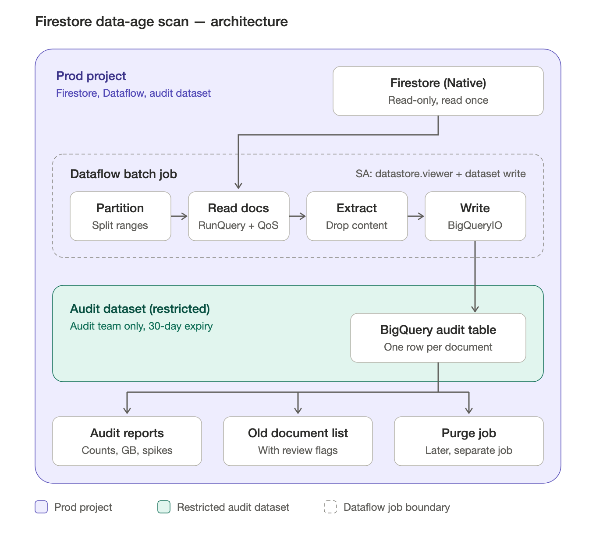

# Data retention audit (7 years) — BigQuery & Firestore

Compliance requires keeping data for **7 years only**. Neither BigQuery nor
Firestore has any purge today, and storage cost is growing. This folder holds
the tooling to **find data older than 7 years**, judged by the **date values in
the data itself** — not by table/collection creation time (a table created last
month can still hold 2015 rows).

| File | What it is |
|---|---|
| [`bq_data_age_audit.sql`](bq_data_age_audit.sql) | Read-only BigQuery script: data age + storage for every table in a project/region |
| [`firestore_data_age_audit.sh`](firestore_data_age_audit.sh) | Read-only Firestore count script (for someone with CLI access) |
| [`docs/firestore-scan-architecture.png`](docs/firestore-scan-architecture.png) | Architecture of the proposed Firestore metadata scan ([SVG source](docs/firestore-scan-architecture.svg)) |

The cutoff everywhere is `CURRENT_DATE() - 7 years`.

---

## Part 1 — BigQuery

**Access needed:** BigQuery Data Viewer on prod + BigQuery Job User on the
project you run from. No tables (not even temp tables) are created.

### Steps

1. **Find the regions your datasets live in** (free):
   ```sql
   SELECT schema_name, location
   FROM `PROD_PROJECT.region-us.INFORMATION_SCHEMA.SCHEMATA`;
   ```
   Repeat with `region-eu`, `region-us-central1`, … until every dataset is accounted for.

2. **Check each dataset's storage billing model** (free) — decides whether the
   logical or physical GB columns matter. No row returned = LOGICAL (default).
   The query is at the bottom of `bq_data_age_audit.sql`.

3. **Prepare the script:** in `bq_data_age_audit.sql`, find/replace
   `PROD_PROJECT` and `region-us`. Adjust the settings at the top if needed:

   | Setting | Default | Meaning |
   |---|---|---|
   | `min_table_gb` | 1 | Tables smaller than this are not scanned (negligible cost) |
   | `max_scan_gb` | 100 | Tables whose estimated scan is larger are skipped, for a manual check |
   | `batch_size` | 50 | Tables checked per query (fewer queries = much faster) |

   If the Firestore audit dataset (Part 2) exists, uncomment the two
   `!= 'audit'` lines so it isn't reported as old data.

4. **Run the whole script at once** in the BigQuery Console. The DECLARE
   block, loop and outputs share variables — running parts separately fails.
   With ~300 tables expect a few minutes. Cancelling mid-run returns nothing.

5. **Download the three outputs** (Console → child jobs → *View results* →
   *Download*):

   | Output | Contents |
   |---|---|
   | 1 — Data age | Per table & date column: oldest/newest value, rows older than 7 years, % old, table size, **estimated old GB** |
   | 2 — Not checked | Every table not scanned, with a reason: below min size / too large / no date-like column / batch errored |
   | 3 — Errors | Failed batches; the message names the failing table |

6. **Follow up:**
   - *Too large* tables → check individually on their business-date column only
     (check the "will process X GB" estimate first).
   - *No date-like column* tables → dates may be epoch INT64, nested in
     STRUCT/ARRAY, or absent; needs owner review.
   - `unparsed_strings > 0` → a STRING date column in a non-ISO format; add a parser.
   - Tables partitioned on their business-date column → exact old GB for free
     via the `PARTITIONS` reference query at the bottom of the script.

### How the script works

1. **Discover** (metadata only, free): `INFORMATION_SCHEMA.COLUMNS` lists every
   `DATE`/`DATETIME`/`TIMESTAMP` column, plus `STRING` columns whose name looks
   like a date (`date|time|_at|_dt|_ts`). Views and external tables are skipped.
2. **Generate** one query per table that reads only those columns. An
   `UNNEST([STRUCT(...), ...])` turns each row's date columns into rows, so a
   **single scan** returns `MIN`, `MAX`, `COUNTIF(< cutoff)` per column.
3. **Batch & run:** tables are grouped into batches (`UNION ALL`) and run with
   `EXECUTE IMMEDIATE ... INTO`; results accumulate in an array variable.
4. **Join storage:** `INFORMATION_SCHEMA.TABLE_STORAGE` adds sizes;
   `est_old_logical_gb = table size × share of rows older than 7 years`.

### Interpreting results

- Pick **one business-date column per table** (`created_at`, `event_date`…).
  Birth dates, expiry dates etc. are not the record's age.
- Ingestion-time partitions (`_PARTITIONTIME`) show *load* date, not data age —
  deliberately ignored.
- Data untouched for 90 days is already billed at long-term (≈ half) price,
  so real savings per GB are lower than the headline rate.
- Deleted data stays billable for the time-travel + fail-safe window (up to 14 days).

### If it's slow

Check where time goes (run in the project the script ran in):

```sql
SELECT job_id,
       TIMESTAMP_DIFF(end_time, start_time, SECOND) AS seconds,
       ROUND(total_bytes_processed / POW(1024, 3), 2) AS gb_scanned,
       total_slot_ms, state
FROM `region-us`.INFORMATION_SCHEMA.JOBS_BY_USER
WHERE parent_job_id = (
  SELECT job_id FROM `region-us`.INFORMATION_SCHEMA.JOBS_BY_USER
  WHERE statement_type = 'SCRIPT' ORDER BY creation_time DESC LIMIT 1)
ORDER BY seconds DESC;
```

High `gb_scanned` → lower `max_scan_gb`. Long `seconds` with low slot usage →
the project's reservation is busy; run off-peak or from an on-demand project.

---

## Part 2 — Firestore (Native mode)

Native mode has **no INFORMATION_SCHEMA and no per-collection statistics**.
Each document only carries system metadata:

| Metadata | Queryable? |
|---|---|
| Document path / ID (`__name__`) | Yes |
| `createTime` — first written | **No** (visible only on documents you read) |
| `updateTime` — last changed | **No** |

Collections have no metadata at all (no count, size or creation date).

### Option A — Console only (works with read-only access, no CLI)

1. **Inventory** — Firestore → Firestore Studio: list top-level collections,
   open a few documents in each, note subcollections. Check the **TTL** tab
   for any existing auto-deletion.
2. **Classify** each collection:

   | Type | How to tell | How to age it |
   |---|---|---|
   | A — has a date field | e.g. `createdAt` timestamp / ISO string | Query builder: order by field ascending, limit 1 → oldest doc. Filter `< 2019-…` → the old docs themselves |
   | B — no date field, auto-IDs | 20-char random IDs | Sample `createTime` (below) |
   | C — no date field, custom IDs | Sequential / natural keys | Date in ID or parent doc? Otherwise needs the full scan (Option B) |

3. **Counts** (type A) — use the *Try it!* panel on
   [`runAggregationQuery`](https://cloud.google.com/firestore/docs/reference/rest/v1/projects.databases.documents/runAggregationQuery),
   parent `projects/PROD_PROJECT/databases/(default)/documents`:
   ```json
   {
     "structuredAggregationQuery": {
       "structuredQuery": {
         "from": [{ "collectionId": "orders" }],
         "where": { "fieldFilter": {
           "field": { "fieldPath": "createdAt" },
           "op": "LESS_THAN",
           "value": { "timestampValue": "2019-09-28T00:00:00Z" } } }
       },
       "aggregations": [{ "alias": "older_than_7y", "count": {} }]
     }
   }
   ```
   Remove `where` for the total. Use `stringValue` / `integerValue` for string
   or epoch dates; add `"allDescendants": true` to include subcollections.
   Cost ≈ 1 read per 1,000 documents counted.

4. **Sampling `createTime`** (type B) — *Try it!* on
   [`runQuery`](https://cloud.google.com/firestore/docs/reference/rest/v1/projects.databases.documents/runQuery):
   ```json
   {
     "structuredQuery": {
       "from": [{ "collectionId": "your_collection" }],
       "select": { "fields": [{ "fieldPath": "__name__" }] },
       "orderBy": [{ "field": { "fieldPath": "__name__" } }],
       "limit": 300
     }
   }
   ```
   Auto-IDs are random, so these 300 docs are a random sample. Search the
   response for `"createTime": "201` (and `"200`) — `old ÷ 300` ≈ share of the
   collection older than 7 years (±~5%).

5. **Size estimate** — no per-collection size in Native mode:
   `collection docs ÷ total docs × total stored data` (billing SKU
   *Cloud Firestore Stored Data* or Monitoring), × % old.

**Limits:** no exact counts or document lists for collections without a date
field, and manual work per collection.

### Option B — Dataflow metadata scan (recommended)

A one-time batch job, run by someone with deploy rights, that reads every
document once and writes **one metadata row per document** to BigQuery. It
covers collections with and without date fields and gives per-collection sizes.



**Pipeline steps** (Beam Java, `FirestoreIO`):

| Step | What it does |
|---|---|
| Collection groups | Input list of collection-group IDs (from the Option A inventory). A group covers every collection with that name at any depth. |
| Partition | `FirestoreIO.v1().read().partitionQuery()` splits each group into ranges so workers read in parallel |
| Read docs | `FirestoreIO.v1().read().runQuery()` returns each document with `createTime`/`updateTime`. `RpcQosOptions` + `maxWorkers` throttle load on prod; a fixed read time gives a consistent snapshot |
| Extract | Computes metadata and **discards all document content** in the worker |
| Write | `BigQueryIO` → `audit.firestore_doc_metadata` (`WRITE_TRUNCATE`) |

**Output table** (clustered by `collection_group`):

| Column | Meaning |
|---|---|
| `doc_path`, `doc_id` | Document path and ID |
| `collection_group`, `collection_path` | e.g. `orders`, `users/{id}/orders` |
| `parent_doc_path`, `depth` | Subcollection lineage |
| `create_time`, `update_time` | System metadata |
| `date_fields` (JSON) | Only date-like values (timestamps, ISO strings, date-named epochs) |
| `est_size_bytes` | Firestore's documented document-size formula (indexes excluded) |
| `scan_time` | When the scan ran |

**Placement & access** — everything stays in the prod project:

- Job service account: `roles/datastore.viewer` (read-only Firestore) +
  `roles/bigquery.dataEditor` **on the audit dataset only** (dataset-level grant).
- Audit dataset: restricted to the audit team, **default table expiration
  30 days**, metadata only — no document content leaves the pipeline.
- Exclude the audit dataset from the BigQuery audit (see Part 1, step 3).
- Expect a prod change-management approval for the new dataset and job.

**Cost:** 1 Firestore read per document (≈ $3–6 per 10M docs) + a few Dataflow
worker-hours. Test on non-prod first, then prod with a small `maxWorkers`, off-peak.

#### Analysis on the output

Per-collection summary:
```sql
SELECT collection_path,
       COUNT(*) AS docs,
       MIN(create_time) AS oldest,
       COUNTIF(create_time < TIMESTAMP(DATE_SUB(CURRENT_DATE(), INTERVAL 7 YEAR))) AS docs_older_than_7y,
       ROUND(SUM(IF(create_time < TIMESTAMP(DATE_SUB(CURRENT_DATE(), INTERVAL 7 YEAR)),
                    est_size_bytes, 0)) / POW(1024, 3), 2) AS old_gb
FROM audit.firestore_doc_metadata
GROUP BY collection_path
ORDER BY old_gb DESC;
```

Document-level list (business date where one exists, else `createTime`):
```sql
DECLARE cutoff TIMESTAMP DEFAULT TIMESTAMP(DATE_SUB(CURRENT_DATE(), INTERVAL 7 YEAR));

WITH date_field_map AS (          -- collections that have a business-date field
  SELECT 'orders' AS collection_path, 'createdAt' AS field UNION ALL
  SELECT 'events', 'event_date'
),
docs AS (
  SELECT m.*,
         SAFE_CAST(JSON_VALUE(m.date_fields, CONCAT('$.', f.field)) AS TIMESTAMP) AS business_date
  FROM audit.firestore_doc_metadata m
  LEFT JOIN date_field_map f USING (collection_path)
)
SELECT collection_path, doc_path,
       COALESCE(business_date, create_time)                       AS age_ts,
       IF(business_date IS NOT NULL, 'date field', 'createTime')  AS age_source,
       update_time >= cutoff                                      AS updated_within_7y,
       est_size_bytes
FROM docs
WHERE COALESCE(business_date, create_time) < cutoff
ORDER BY collection_path, age_ts;
```

#### Can `createTime` be trusted?

`createTime` is when the document was **written to Firestore**, not when the
record was born. It is wrong for data that was migrated, imported/restored,
or deleted-and-rewritten. Validate before relying on it:

- **Migration spikes** — a huge count on a single day means a bulk load:
  ```sql
  SELECT collection_path, DATE(create_time) AS day, COUNT(*) AS docs
  FROM audit.firestore_doc_metadata
  GROUP BY 1, 2
  QUALIFY docs > 10 * AVG(docs) OVER (PARTITION BY collection_path)
  ORDER BY docs DESC;
  ```
- **Cross-check** `createTime` against a real date field in collections that have one.
- Ask the team: *was any collection migrated, imported or restored?*

Where it can't be trusted: use the ID / parent / linked record, or escalate to
compliance — unknown age is a compliance risk, not a reason to keep data.

#### Review before purging

| Case | Why |
|---|---|
| Old but `updated_within_7y` | May be an active record — does policy run from creation or last activity? |
| Subcollections | Deleting a parent does **not** delete its subcollections |
| `createTime` inside a migration spike | Age may be wrong |
| Legal hold | Exclude held IDs (list from compliance) |

---

## Part 3 — Next steps (purge)

| Store | Approach |
|---|---|
| BigQuery, partitioned on business date | `partition_expiration_days = 2557` (≈ 7 years) |
| BigQuery, not partitioned | Scheduled `DELETE … WHERE date_col < DATE_SUB(CURRENT_DATE(), INTERVAL 7 YEAR)`; consider re-creating as partitioned |
| Firestore, one-time cleanup | Purge job reads the approved list from the audit table and deletes via `FirestoreIO…batchWrite()` with an `updateTime` precondition, so docs changed since the scan are skipped |
| Firestore, ongoing | Backfill `createdAt` (from date field / ID / parent / `createTime`) + `expireAt = createdAt + 7y`, set both on write in app code, enable **TTL policies** |

Take a backup/export before any deletion and get compliance sign-off on the
business-date column per table/collection.
